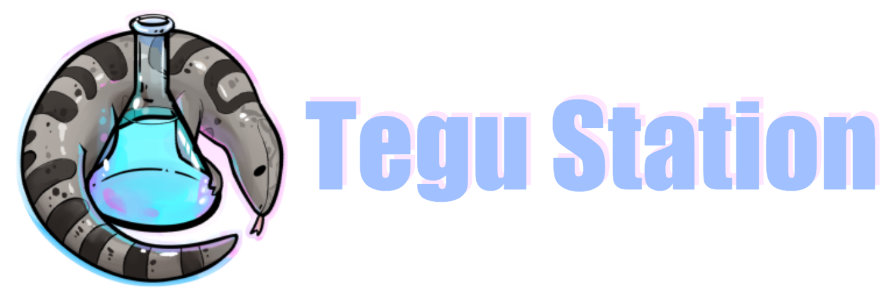

### 
### Welcome to the original code repository for **Lobotomy Corporation 13**, a fork of [TeguStation](https://github.com/vlggms/tegustation).

  

## Community

[Discord] (https://discord.gg/hKm3caurDY) is the place where most of the discussion happens, due to absence of a forum. Here you can contact administrators, ask mentors for help, or simply discuss your rounds. It is also a place where you can find links to ban appeals, admin applications and others, which could be really useful.

This server is based on the game **Lobotomy Corporation** created by **Project Moon**.
We highly recommend that you try it for yourself!

**Steam Page:** [https://store.steampowered.com/app/568220/Lobotomy_Corporation__Monster_Management_Simulation] (Lobotomy Corporation: Monster Management Simulation)
**Trailers:** [First] (https://www.youtube.com/watch?v=VmHORmTGmm0), [Second] (https://www.youtube.com/watch?v=WbN40vpse0k)

## Information
* **Code:** https://github.com/vlggms/lobotomy-corp13
* **TeguStation Discord:** https://discord.gg/AzmEhtH
* **/tg/Station Wiki:** https://tgstation13.org/wiki/Main_Page

## Downloading and running a server
[Downloading](.github/DOWNLOADING.md)

[Running on the server](.github/RUNNING_A_SERVER.md)

[Maps and Away Missions](.github/MAPS_AND_AWAY_MISSIONS.md)

## Contributing
[Guidelines for Contributors](.github/CONTRIBUTING.md)

[Documenting your code](.github/AUTODOC_GUIDE.md)

[Policy configuration system](.github/POLICYCONFIG.md)

[Interested in some starting lore? (/tg/)](https://github.com/tgstation/common_core)

## LICENSE

All code after [commit 333c566b88108de218d882840e61928a9b759d8f on 2014/31/12 at 4:38 PM PST](https://github.com/tgstation/tgstation/commit/333c566b88108de218d882840e61928a9b759d8f) is licensed under [GNU AGPL v3](https://www.gnu.org/licenses/agpl-3.0.html).

All code before [commit 333c566b88108de218d882840e61928a9b759d8f on 2014/31/12 at 4:38 PM PST](https://github.com/tgstation/tgstation/commit/333c566b88108de218d882840e61928a9b759d8f) is licensed under [GNU GPL v3](https://www.gnu.org/licenses/gpl-3.0.html).
(Including tools unless their readme specifies otherwise.)

See LICENSE and GPLv3.txt for more details.

The TGS DMAPI API is licensed as a subproject under the MIT license.

See the footer of [code/__DEFINES/tgs.dm](./code/__DEFINES/tgs.dm) and [code/modules/tgs/LICENSE](./code/modules/tgs/LICENSE) for the MIT license.

All assets including icons and sound are under a [Creative Commons 3.0 BY-SA license](https://creativecommons.org/licenses/by-sa/3.0/) unless otherwise indicated.
